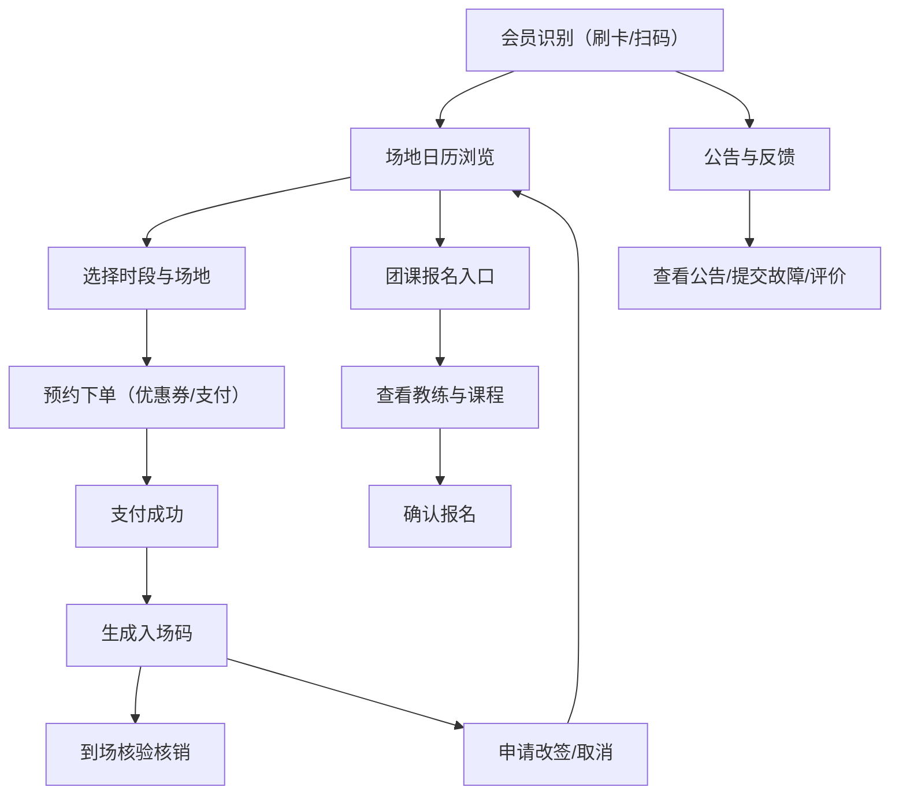

## 1. 产品概述
智慧体育场馆自助预约触屏终端程序，部署于篮球馆、羽毛球馆、游泳馆前台，供会员自助办理预约、入场、改签等业务。
- 解决前台人工办理效率低、排队等候时间长的痛点，提升会员体验与场馆运营效率
- 面向场馆会员与临时访客，支持7×24小时自助服务，降低人工成本

## 2. 核心功能

### 2.1 用户角色
| 角色 | 登录方式 | 核心权限 |
|------|---------|---------|
| 会员用户 | 刷卡（RFID）/ 扫码（二维码） | 场地预约、入场核验、改签取消、课程报名、反馈评价 |
| 场馆管理员 | 工号密码登录 | 发布公告、统计当日预约、核销管理、超时提醒 |

### 2.2 功能模块
1. **场地日历页**：场馆类型切换、日历视图、空闲时段热力图、场地列表
2. **会员识别页**：刷卡登录区、扫码登录区、会员信息展示、快速入口
3. **预约下单页**：时段选择、场地/人数选择、优惠券、订单确认、支付状态
4. **入场核验页**：入场码展示、二维码/条形码、打印入场码、核销确认
5. **临时改签页**：我的预约列表、取消申请、改签申请、规则说明
6. **课程报名页**：团课日历、教练信息、课程详情、报名确认
7. **公告与反馈页**：闭馆通知、设施故障提交、服务评价、统计看板

### 2.3 页面详情
| 页面名称 | 模块名称 | 功能描述 |
|---------|---------|---------|
| 场地日历 | 场馆切换栏 | 篮球馆/羽毛球馆/游泳馆快速切换，带图标与状态标识 |
| 场地日历 | 月份日历 | 可滑动切换月份，日期格显示预约饱和度颜色标记 |
| 场地日历 | 时段热力图 | 按小时显示各场地空闲/繁忙/已满状态，支持触屏滚动 |
| 场地日历 | 场地卡片列表 | 显示场地编号、设施标签、当前价格、立即预约按钮 |
| 会员识别 | 刷卡感应区 | 大尺寸感应动画区域，提示放置会员卡，读取后展示会员头像/姓名/等级/余额 |
| 会员识别 | 扫码登录区 | 动态二维码扫描框，支持微信/APP扫码授权登录 |
| 会员识别 | 快速入口卡片 | 我的预约、我的课程、我的优惠券、消费记录快捷入口 |
| 预约下单 | 时段选择条 | 横向滚动时段卡片，选中高亮，不可用时段置灰 |
| 预约下单 | 场地人数配置 | 场地下拉选择、人数步进器（+/-按钮大尺寸适配触屏） |
| 预约下单 | 优惠券面板 | 可用优惠券列表，单选切换，显示优惠金额 |
| 预约下单 | 订单确认卡 | 明细清单、原价/优惠/实付金额、确认支付按钮 |
| 预约下单 | 支付状态展示 | 支付中动画、成功/失败结果页、重试入口 |
| 入场核验 | 入场码展示区 | 大号动态二维码 + 条形码 + 入场码编号文本 |
| 入场核验 | 打印功能区 | 一键打印入场小票按钮，含打印预览提示 |
| 入场核验 | 核销操作区 | 工作人员核销入口、超时未到提醒弹窗 |
| 临时改签 | 预约列表 | 卡片式展示近期预约，含状态标签（待使用/已完成/已取消） |
| 临时改签 | 取消/改签操作 | 大按钮操作，改签时跳转日历选择新时段，规则弹窗提示 |
| 课程报名 | 团课周历 | 按周展示课程排期，卡片含课程名/教练/时长/剩余名额 |
| 课程报名 | 教练信息卡 | 教练头像、擅长项目、教龄、会员评分、学员评价 |
| 课程报名 | 报名确认 | 课程信息汇总、人数确认、报名提交、结果反馈 |
| 公告与反馈 | 公告滚动栏 | 横向滚动闭馆通知/活动公告，支持点击展开详情 |
| 公告与反馈 | 故障提交表单 | 场馆选择、故障类型、描述输入（语音/文字）、照片上传占位 |
| 公告与反馈 | 星级评价组件 | 5星大图标点击评分、标签快速评价、文字反馈 |
| 公告与反馈 | 统计看板 | 当日预约总数、各场馆分布、入场率、热门时段柱状图 |

## 3. 核心流程
会员刷卡/扫码登录 → 选择场馆查看日历与空闲时段 → 选择场地/时段/人数下单 → 使用优惠券确认支付 → 获取入场码 → 到场扫码核销入场；若需变更可申请取消或改签；同时可报名团课、查看教练、提交反馈。

## 4. 用户界面设计
### 4.1 设计风格
- **主色调**：深海蓝 #0A4D8C（专业、稳重），运动橙 #FF6B2C（活力、行动）
- **辅助色**：成功绿 #22C55E、警告黄 #F59E0B、错误红 #EF4444
- **按钮风格**：大尺寸圆角（16px）、实心渐变主按钮、幽灵次按钮、点击态缩放+阴影
- **字体**：标题使用 "Oswald"（力量感无衬线），正文使用 "Noto Sans SC"（中文可读性）
- **布局风格**：卡片式网格化布局，大间距（16-24px），左侧主导航栏+右侧内容区
- **图标风格**：双色线性图标（Lucide风格），关键操作按钮配emoji增强识别度

### 4.2 页面设计概述
| 页面名称 | 模块名称 | UI 元素 |
|---------|---------|---------|
| 场地日历 | 日历热力图 | 深蓝背景+橙色高亮时段，卡片悬浮阴影，切换过渡动画0.3s |
| 会员识别 | 感应区 | 脉冲波纹动画，刷卡成功后绿色边框扩散，信息卡从底部滑入 |
| 预约下单 | 支付流程 | 步骤指示器渐变线连接，支付中环形加载动画，成功页礼花粒子 |
| 入场核验 | 入场码 | 二维码居中放大，底部白色票根造型（撕线纹理），编号等宽字体 |
| 临时改签 | 预约卡片 | 状态色左边框，悬浮微抬升，操作按钮滑出效果 |
| 课程报名 | 教练卡 | 圆形头像+渐变边框，评分星星填充动画，擅长标签彩色胶囊 |
| 公告与反馈 | 统计看板 | 数字滚动动画，柱状图渐变填充，卡片玻璃态效果 |

### 4.3 响应式
- **桌面优先**：基准分辨率 1920×1080（触屏终端标准）
- **触屏优化**：所有可点击元素最小尺寸 48×48px，关键操作按钮 ≥ 72px 高度
- **手势支持**：日历支持左右滑动切换月份，列表支持上下惯性滚动
- **大屏适配**：使用 rem 单位，在 2K/4K 屏幕自动等比缩放

### 4.4 3D 场景指引
- 不适用，本项目为 2D 触屏终端界面，以卡片、渐变、动画营造层次感
