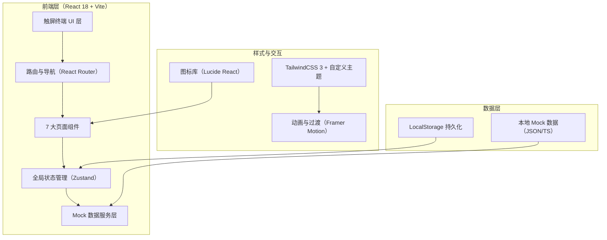
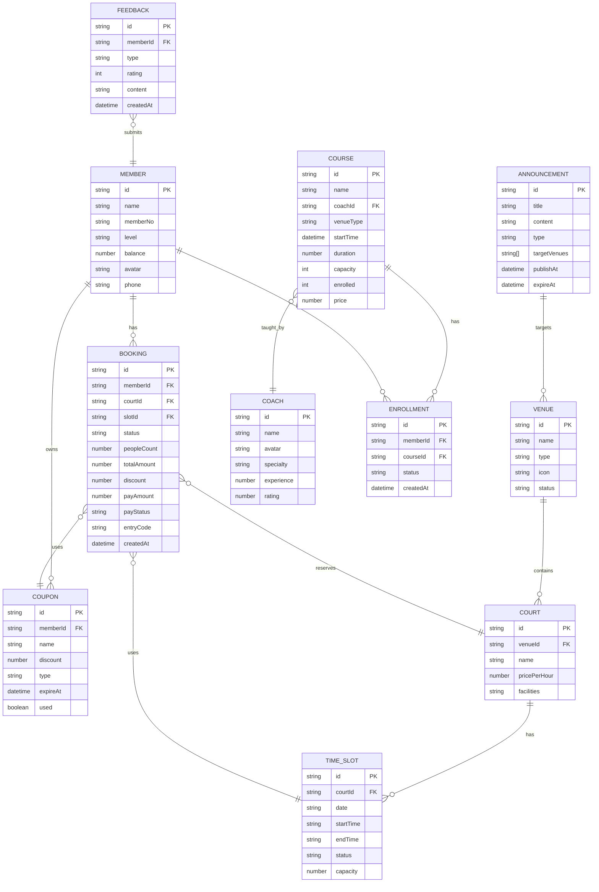

## 1. 架构设计


## 2. 技术说明
- **前端框架**：React@18 + TypeScript@5 + Vite@5
- **初始化工具**：pnpm create vite（React + TypeScript 模板）
- **路由**：react-router-dom@6
- **状态管理**：zustand@4（轻量、极简 API，适合终端场景）
- **样式方案**：tailwindcss@3 + postcss + autoprefixer
- **动画库**：framer-motion@11（页面切换、微交互）
- **图标库**：lucide-react@0.400
- **二维码生成**：qrcode.react@3
- **图表**：recharts@2（统计看板柱状图、饼图）
- **后端**：无，纯前端 Mock 数据模拟
- **数据库**：无，使用 TypeScript 常量 + localStorage 模拟持久化

## 3. 路由定义
| 路由 | 用途 |
|-----|------|
| / | 重定向到场地日历页 |
| /calendar | 场地日历页（首页） |
| /login | 会员识别页 |
| /booking | 预约下单页 |
| /entry | 入场核验页 |
| /reschedule | 临时改签页 |
| /courses | 课程报名页 |
| /feedback | 公告与反馈页 |

## 4. 数据模型
### 4.1 数据模型定义


### 4.2 目录结构
```
src/
├── assets/              # 静态资源（图片、字体）
├── components/          # 通用组件
│   ├── layout/          # 布局组件（侧边栏、顶栏）
│   ├── ui/              # 基础UI（按钮、卡片、输入框）
│   └── features/        # 业务组件（日历、时段图等）
├── pages/               # 7大页面
│   ├── Calendar.tsx
│   ├── Login.tsx
│   ├── Booking.tsx
│   ├── Entry.tsx
│   ├── Reschedule.tsx
│   ├── Courses.tsx
│   └── Feedback.tsx
├── store/               # Zustand stores
│   ├── useMemberStore.ts
│   ├── useBookingStore.ts
│   └── useUiStore.ts
├── data/                # Mock 数据
│   ├── venues.ts
│   ├── members.ts
│   ├── bookings.ts
│   ├── courses.ts
│   └── announcements.ts
├── types/               # TypeScript 类型定义
│   └── index.ts
├── utils/               # 工具函数
│   ├── date.ts
│   ├── format.ts
│   └── qrcode.ts
├── hooks/               # 自定义 hooks
├── App.tsx
├── main.tsx
└── index.css
```

## 5. 全局状态设计
- **useMemberStore**：当前登录会员信息、登录状态、登出方法
- **useBookingStore**：选中的场馆/日期/时段/场地、购物车订单、优惠券、入场码
- **useUiStore**：侧边栏折叠状态、全局 Loading、Toast 消息栈、当前激活 Tab

## 6. 触屏交互规范
- 所有按钮 `min-width: 72px, min-height: 72px`（主操作）
- 次要点击目标 `min-width: 48px, min-height: 48px`
- 防止误触：`touch-action: manipulation`
- 列表惯性滚动：`-webkit-overflow-scrolling: touch`
- 长按反馈：0.5s 触发二级菜单/详情
- 滑动手势：水平切换日期、垂直滚动列表
